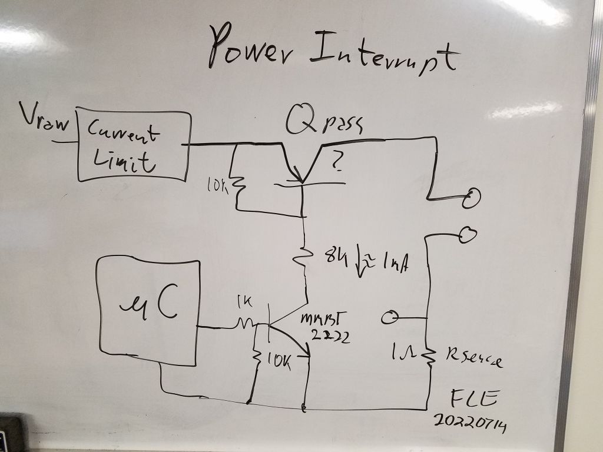
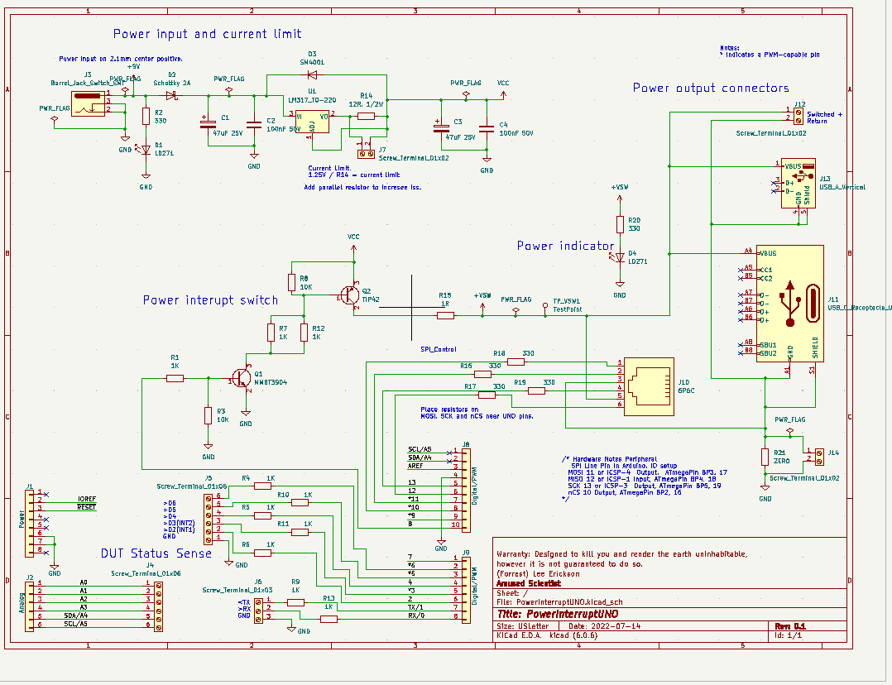
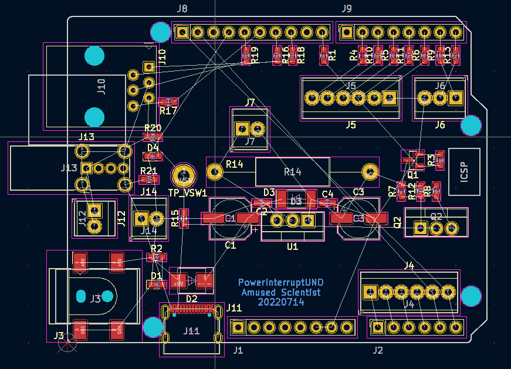

# PowerInterruptUNO
## A power interrupt test device biased on UNO shield.  
For some time I have wished for a test system to interupt power, make power drop outs, of programable length to stress test micro controller based systems against unreliable reset in the cases of power interupt. I had ideas for years and finaly put something on my white board back during the early days of COVID when I was in my lab doing long over due continuing education and haunting the FaceBook groups for Arduino and ESP. I was struck how many persons were having trouble with systems not staring reliably and noticed that many micro controller development boards did not have a diode to discharge the /Reset line on a power drop out.

So I present, A shield which will switch or interrupt power to a DUT. The power comes in on a 2.1mm barrel jack and goes out on screw terminals, USB Type A connector and USB type C and on an RJ12.

The white board schematic that started it ?last year or earlier?.
KiCad 6 schematic started 20220714 about 2:00 PM EDT.

The schematic

The component palcement

